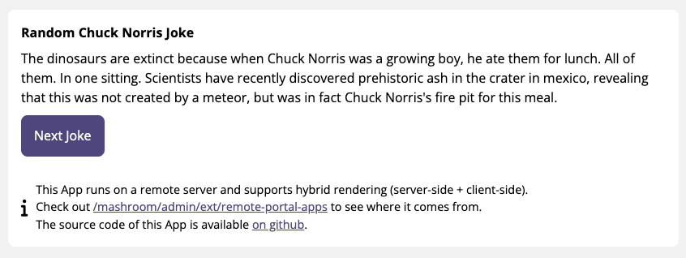

# Mashroom Demo Server-Side Rendering Remote Portal App

Demo App (SPA) for [Mashroom Server](https://www.mashroom-server.com) that shows a random Chuck Norris joke from
[http://api.icndb.com](http://api.icndb.com).
This App comes with its own server and *BFF* (Backend For Frontend) and can be integrated as a *Remote App*
into *Mashroom Portal*.

This demo is similar to [https://github.com/nonblocking/mashroom-demo-remote-portal-app](https://github.com/nonblocking/mashroom-demo-remote-portal-app)
but additionally shows how server-side rendering can be used in Remote Apps.

It also runs on [http://demo-ssr-remote-app.mashroom-server.com](http://demo-ssr-remote-app.mashroom-server.com)
if you want to test the Remote App capabilities of _Mashroom Portal_ without installing this first.



## Usage

    npm install
    npm run dev

Open in your browser the test page: http://localhost:6089/

To just get the initial HTML: http://localhost:6089/test_ssr

To test the route Mashroom uses to get the initial HTML:
POST a JSON body with an empty *portalAppSetup* like this:

```json
{
    "portalAppSetup": {
        "appConfig": {}
    }
}
```

to: http://localhost:6089/api/ssr

### Integrate it into the Mashroom Portal

 * Clone, setup and start the [Mashroom Portal Quickstart](https://github.com/nonblocking/mashroom-portal-quickstart) project
 * Open http://localhost:5050/mashroom/admin/ext/remote-portal-apps
 * Copy http://localhost:6089 into the URL input and click _Add_
 * Open http://localhost:5050/portal and place the _Mashroom Demo Remote Portal App_ on any page via Drag'n'Drop

**NOTE**: Requires Mashroom >=2.0.0
